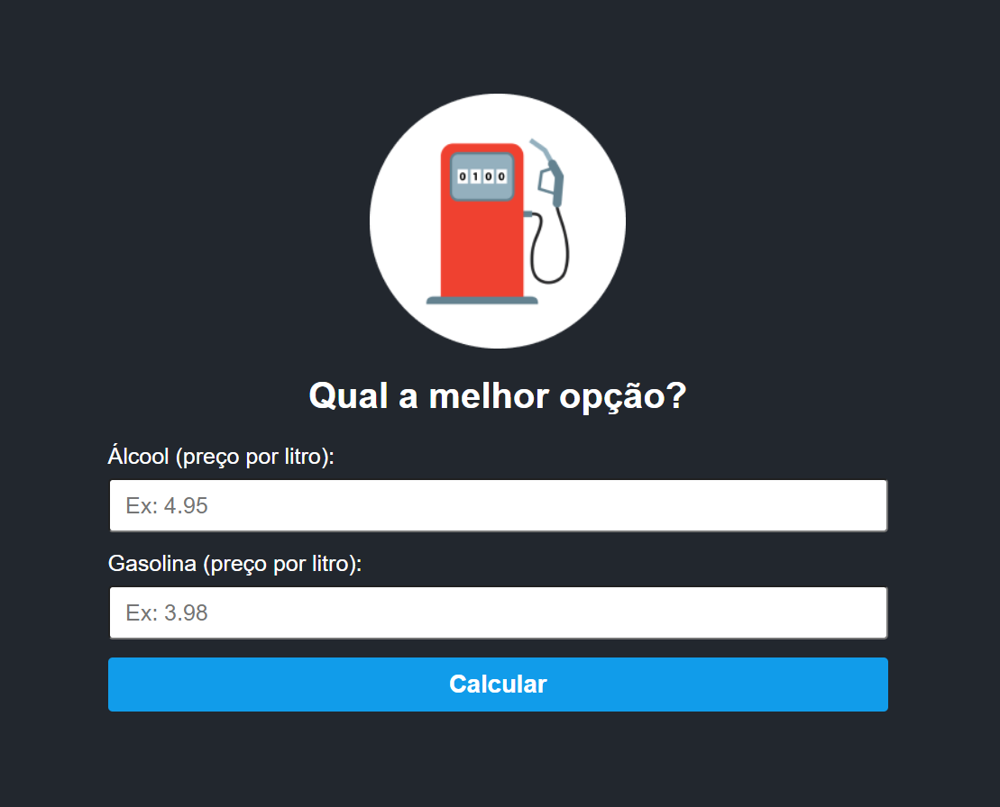

<h1 align="center"> Calculadora Gasolina ou Álcool </h1>

Evento gratuito, promovido pelo canal no YouTUBE Sujeito programador

  <a href="#-tecnologias">Tecnologias</a>&nbsp;&nbsp;&nbsp;|&nbsp;&nbsp;&nbsp;
  <a href="#-projeto">Projeto</a>&nbsp;&nbsp;&nbsp;|&nbsp;&nbsp;&nbsp;
  <a href="#-layout">Layout</a>&nbsp;&nbsp;&nbsp;|&nbsp;&nbsp;&nbsp;

 

  

## 🚀 Tecnologias

Esse projeto foi desenvolvido com as seguintes tecnologias:

- HTML e CSS
- JavaScript
- Git e Github

## 💻 Projeto

A calculadora de Gasolina ou Álcool é um projeto que calcula com base nos preços dos postos de combustíveis, inseridos pelo usuário
qual combustível seria mais benéfico através de um cálculo matemático.

